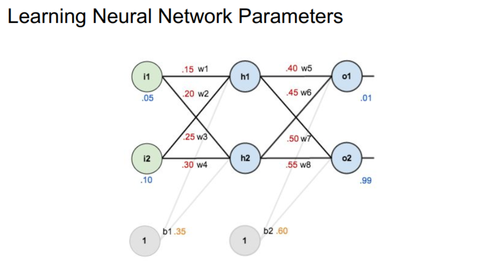

# Neural-Network-Implementation-with-PyTorch

This repository contains the implementation of a basic Artificial Neural Network (ANN) using both manual tensor operations and PyTorch’s built-in functions.

## 🧐 Project Overview

The goal of this projecy is to manually implement a single hidden layer neural network and then replicate the same using PyTorch's built-in neural network functionalities. Below is a visual representation of the neural network used in this project:



### ✔️ Objectives:

* Implement forward propagation manually using tensors
* Calculate Mean Squared Error (MSE) loss
* Perform manual backpropagation using PyTorch's `autograd`
* Update weights using gradient descent
* Re-implement the same architecture using `torch.nn` and `torch.optim`

## 🛠️ Technologies Used

* Python
* PyTorch
* Jupyter Notebook

## 📈 Results

Both manual and PyTorch-based implementations achieve very low error with predictions close to the expected output:

```
Final Error (Manual): 1.6677285e-12  
Predicted Output: [[0.01000133, 0.98999876]]

Final Error (PyTorch): 2.3393960379980427e-13  
Predicted Output: [[0.01000054, 0.9899996]]
```

## 🚀 How to Run

1. Clone this repository:

   ```bash
   git clone https://github.com/M-A-S1/Neural-Network-Implementation-with-PyTorch
   cd Neural-Network-Implementation-with-PyTorch
   ```

2. (Optional) Create and activate a virtual environment:

   ```bash
   python -m venv venv
   source venv/bin/activate  # On Windows: venv\Scripts\activate
   ```

3. Install dependencies:

   ```bash
   pip install torch jupyter
   ```

4. Launch the notebook:

   ```bash
   jupyter notebook nn.ipynb
   ```

## 📬 Contact

For any queries or clarifications, feel free to contact:

📧 [muhammad.ali@example.com](mailto:muali.msee24seecs@seecs.edu.pk)
📘 [LinkedIn](https://www.linkedin.com/in/muhammad-ali-sid/)

---

⭐ If you find this project helpful, feel free to star the repo!
